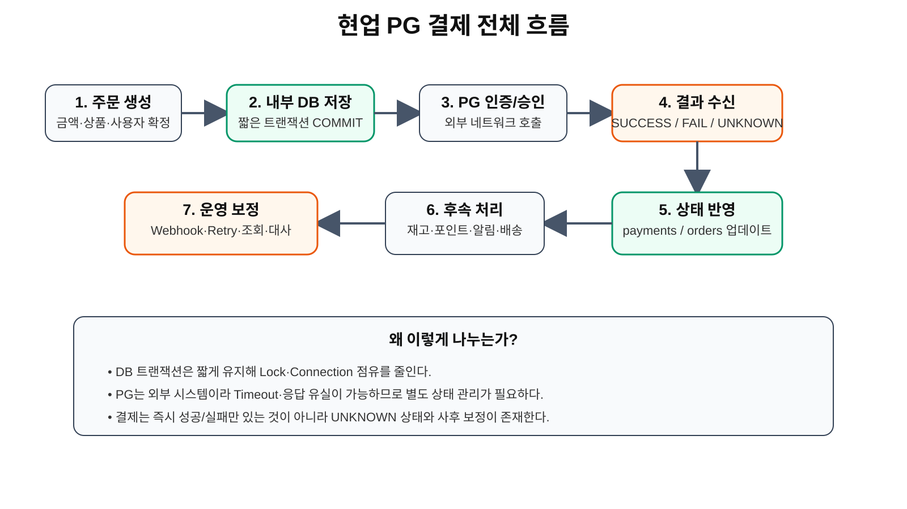
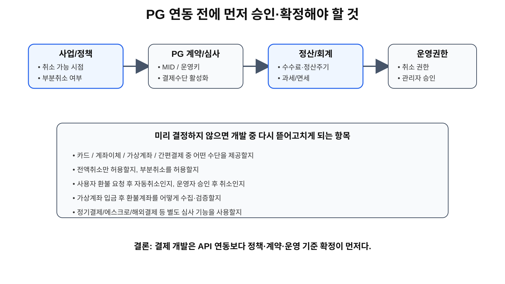
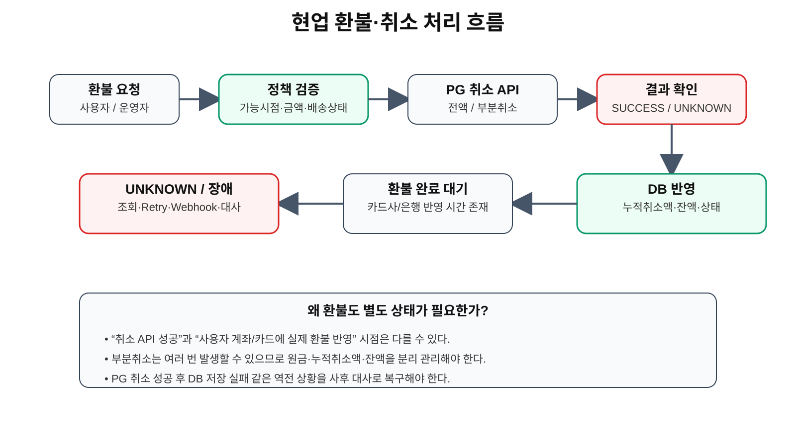
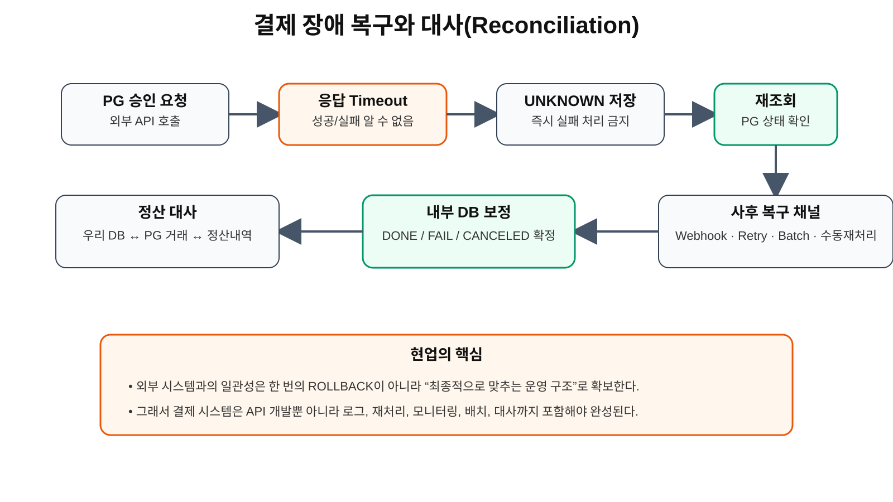

# TIL - 2026-09-22

# 현업 PG 결제 시스템 설계
## 승인 준비부터 결제·환불·장애복구·정산까지

## 오늘 한 일

오늘은 PostgreSQL 트랜잭션에서 한 단계 더 나아가, **실제로 PG사를 붙여 결제 기능을 개발한다고 가정했을 때 무엇을 설계해야 하는지** 현업 관점으로 정리했다.

단순히 결제 API를 호출하는 수준이 아니라 다음 전체 수명주기를 기준으로 보았다.

```text
PG 계약 / 가맹점 심사
↓
결제 정책 확정
↓
주문 생성
↓
결제 인증
↓
결제 승인
↓
내부 DB 상태 반영
↓
Webhook / 재조회
↓
취소 / 부분취소 / 환불
↓
장애 복구
↓
정산 / 대사
↓
운영 모니터링
```

핵심은 다음과 같다.

> **결제 시스템은 “돈을 받는 API”가 아니라, 외부 결제사와 우리 서비스의 상태를 끝까지 맞추는 시스템이다.**

---

# 1. 전체 구조부터 보기



현업에서는 결제를 하나의 긴 DB 트랜잭션으로 묶지 않는다.

기본 구조는 다음처럼 나눈다.

```text
1. 주문 생성
2. 내부 DB 저장
3. DB COMMIT
4. PG API 호출
5. PG 결과 수신
6. 결과 DB 반영
7. 후속 비즈니스 처리
8. 필요 시 재조회 / Retry / 대사
```

### 왜 이렇게 나누는가?

PG API는 외부 네트워크를 타기 때문에 다음 문제가 발생할 수 있다.

- Timeout
- 응답 유실
- PG 자체 장애
- 우리 서버 장애
- 사용자의 중복 클릭
- 승인 성공 후 우리 서버 종료
- Webhook 지연
- 취소 성공 후 DB 저장 실패

따라서 외부 호출을 기다리는 동안 DB 트랜잭션을 오래 잡고 있으면 안 된다.

현업에서는 일반적으로

> **DB 트랜잭션은 짧게, 외부 API는 별도 상태로 관리**

하는 방향이 안전하다.

---

# 2. 개발 전에 먼저 확정해야 하는 것

결제 시스템은 코드부터 작성하면 안 된다.

먼저 사업·재무·CS·개발·PG사와 결제 정책을 확정해야 한다.



## 2-1. PG사 계약 / 가맹점 심사

실서비스에서는 일반적으로 다음 과정이 먼저 필요하다.

```text
사업자 정보 준비
↓
PG 계약 신청
↓
가맹점 심사
↓
서비스/상품 검토
↓
정산 계좌 등록
↓
MID / Merchant ID 발급
↓
운영 API Key 발급
↓
결제수단 활성화
```

테스트 환경에서는 별도 Test Key를 사용할 수 있지만 실제 결제는 운영용 Merchant 정보와 Key가 필요하다.

### 개발 전에 확인할 것

- 사업자 정보
- 대표자 / 담당자 정보
- 정산 계좌
- 사이트 URL
- 서비스 이용약관
- 개인정보처리방침
- 취소 / 환불 정책
- 상품 또는 서비스 유형
- 과세 / 면세 여부
- 정산 주기
- PG 수수료
- 허용 결제수단

---

# 3. 별도 심사 또는 별도 신청이 필요한 기능

결제수단마다 PG 계약만 끝났다고 자동으로 전부 활성화되는 것은 아니다.

서비스 성격과 PG사 정책에 따라 별도 신청·심사 또는 계약이 필요할 수 있다.

대표적으로 확인할 항목은 다음과 같다.

- 신용카드
- 실시간 계좌이체
- 가상계좌
- 간편결제
- 휴대폰 결제
- 해외카드
- 에스크로
- 정기결제 / 빌링키
- 부분취소
- 면세 / 복합과세

### 왜 미리 결정해야 하는가?

예를 들어 부분취소를 고려하지 않고 DB를 설계하면

```text
payment.amount
payment.status
```

정도로 끝낼 수 있다.

하지만 실제 서비스에서 부분취소가 필요하면

```text
원결제금액
누적취소금액
잔여금액
취소 이력
각 취소 거래의 PG Transaction Key
```

가 필요해진다.

즉 결제 정책이 DB 구조를 바꾼다.

---

# 4. 먼저 만들어야 할 결제 정책표

개발 시작 전에 다음 정책을 문서로 확정하는 것이 좋다.

| 정책 | 결정해야 할 내용 |
|---|---|
| 결제수단 | 카드 / 계좌이체 / 가상계좌 / 간편결제 |
| 결제시점 | 주문 즉시 / 예약 시 / 배송 전 |
| 취소 | 사용자 즉시취소 / 운영자 승인 |
| 부분취소 | 허용 / 비허용 |
| 환불시점 | PG 취소 요청 시점과 실제 금융기관 반영 시점 분리 |
| 배송 후 환불 | 가능 조건 |
| 가상계좌 | 입금기한 / 환불계좌 처리 |
| 포인트 | 결제취소 시 복구 순서 |
| 쿠폰 | 재발급 여부 |
| 재고 | 결제 실패/취소 시 복구 |
| 정산 | PG 정산 주기와 내부 매출 기준 |
| 운영권한 | 누가 강제취소 / 상태보정 가능한지 |

---

# 5. 결제 승인 전체 흐름

현업 결제 흐름은 대략 다음과 같다.

```text
사용자
↓
상품 선택
↓
우리 서버에서 주문 생성
↓
ORDER_CREATED
↓
결제창 / 결제수단 인증
↓
PG 인증 결과 수신
↓
우리 서버에서 금액 재검증
↓
PG 승인 API 호출
↓
결제 성공
↓
payments 저장
↓
orders = PAID
↓
후속 업무 시작
```

여기서 중요한 것은 **결제창에서 성공 화면이 떴다고 바로 결제완료로 믿지 않는 것**이다.

우리 서버에서 반드시 다시 검증해야 한다.

---

# 6. 결제 승인 전 서버 검증

PG 승인 API를 호출하기 전에 최소한 다음 항목을 검증한다.

```text
orderId 존재 여부
↓
현재 주문 상태 확인
↓
DB의 주문 금액 확인
↓
PG에서 전달된 금액과 비교
↓
중복 승인 여부 확인
↓
취소된 주문인지 확인
↓
결제 가능한 상태인지 확인
```

## 반드시 검증할 항목

- orderId가 실제 우리 주문인가
- 사용자와 주문 소유자가 일치하는가
- DB 금액과 PG 승인 요청 금액이 같은가
- 이미 결제 완료된 주문이 아닌가
- 이미 취소된 주문이 아닌가
- 동일 주문에 결제가 중복 생성되지 않았는가
- 쿠폰/포인트가 변경되지 않았는가
- 재고가 여전히 유효한가

### 중요한 원칙

> **프론트엔드에서 넘어온 금액을 신뢰하지 않는다.**

승인 금액은 항상 우리 서버 DB의 주문 금액과 비교한다.

---

# 7. DB 테이블을 어떻게 나눌 것인가

결제 시스템을 하나의 `orders` 테이블에 전부 넣으면 나중에 운영이 어려워진다.

실무적으로는 최소 다음 영역을 분리하는 것이 좋다.

```text
orders
payments
payment_transactions
refunds
payment_webhook_events
settlements
```

## orders

주문 자체의 비즈니스 상태를 관리한다.

예:

```text
order_id
user_id
total_amount
order_status
created_at
paid_at
canceled_at
```

## payments

PG 결제 단위의 현재 상태를 관리한다.

```text
payment_id
order_id
pg_provider
payment_key
method
requested_amount
approved_amount
payment_status
approved_at
```

## payment_transactions

승인·취소·부분취소 같은 개별 금융 이벤트를 기록한다.

```text
transaction_id
payment_id
transaction_type
amount
pg_transaction_key
status
requested_at
completed_at
```

예:

```text
APPROVE
CANCEL
PARTIAL_CANCEL
REFUND
```

## refunds

업무적으로 환불을 관리한다.

```text
refund_id
payment_id
refund_amount
refund_reason
requested_by
refund_status
requested_at
approved_at
completed_at
```

## payment_webhook_events

Webhook 원본 이벤트를 저장한다.

```text
event_id
event_type
external_event_id
payload
received_at
processed_at
process_status
```

### 왜 원본 Webhook도 저장하는가?

문제가 생겼을 때

> “PG가 실제로 어떤 이벤트를 언제 보냈는가?”

를 추적할 수 있어야 하기 때문이다.

---

# 8. 주문 상태와 결제 상태를 분리해야 한다

주문과 결제는 동일한 상태가 아니다.

예:

```text
주문 상태
ORDER_CREATED
PAYMENT_PENDING
PAID
PREPARING
SHIPPED
COMPLETED
CANCELED
```

결제 상태:

```text
READY
IN_PROGRESS
DONE
FAILED
UNKNOWN
PARTIAL_CANCELED
CANCELED
```

### 왜 분리해야 하는가?

예를 들어

```text
결제 = DONE
주문 = CANCELED
```

상태가 존재할 수 있다.

결제는 성공했지만 상품 품절로 주문을 취소하고 환불하는 상황이다.

즉

> **주문 상태 ≠ 결제 상태**

이다.

---

# 9. UNKNOWN 상태를 반드시 고려한다

현업에서 중요한 개념이다.

결제는 성공/실패 두 개만 있는 것이 아니다.

다음 상황을 생각할 수 있다.

```text
우리 서버
↓
PG 승인 요청
↓
PG에서는 승인 성공
↓
우리 서버로 응답하는 순간 네트워크 장애
↓
우리 서버는 응답을 못 받음
```

이때 우리 서버는

```text
SUCCESS ?
FAIL ?
```

을 알 수 없다.

따라서 내부적으로

```text
UNKNOWN
```

또는

```text
PAYMENT_CONFIRMING
```

같은 상태를 둘 수 있다.

그 후

```text
PG 결제 조회 API
↓
실제 상태 확인
↓
DONE 또는 FAILED로 보정
```

한다.

### 왜 바로 실패 처리하면 안 되는가?

이미 카드에서는 돈이 승인되었는데 우리 DB가 실패로 기록될 수 있기 때문이다.

---

# 10. DB 트랜잭션과 PG API를 어떻게 연결할 것인가

잘못 설계하면 다음처럼 만들 수 있다.

```text
BEGIN

주문 INSERT

PG API 호출
← 네트워크 대기

결제 결과 저장

COMMIT
```

문제점:

- Transaction이 오래 열린다.
- DB Lock 시간이 길어진다.
- Connection을 오래 점유한다.
- PG 응답이 느리면 DB까지 영향을 받는다.
- 장애 범위가 커진다.

현업에서는 보통 다음처럼 분리한다.

```text
[Transaction 1]

BEGIN
주문 생성
결제시도 상태 저장
COMMIT

↓
PG API 호출
↓

[Transaction 2]

BEGIN
결제 결과 저장
주문 상태 변경
COMMIT
```

### 핵심

> **로컬 DB의 원자성과 외부 PG 통신의 원자성은 서로 다르다.**

그래서 외부 호출 실패를 상태와 보상처리로 관리한다.

---

# 11. 중복 결제를 막아야 한다

사용자는 결제 버튼을 여러 번 누를 수 있다.

서버도 Timeout 후 자동 Retry를 할 수 있다.

```text
결제 버튼 클릭
↓
응답 지연
↓
사용자가 다시 클릭
↓
서버가 승인 API를 두 번 호출
```

이를 막기 위해 다음을 사용한다.

- 고유한 orderId
- payment 단위 Unique Constraint
- 현재 payment status 확인
- Idempotency Key
- 중복 요청 로그
- 서버 측 재진입 방지

### Idempotency

동일 요청을 여러 번 보내도 결과가 한 번만 반영되게 만드는 개념이다.

결제·취소 API에서는 매우 중요하다.

---

# 12. 환불 / 취소의 전체 흐름



서비스에서는 환불 버튼 하나로 끝나지 않는다.

```text
환불 요청
↓
환불 가능 여부 검증
↓
환불 금액 계산
↓
운영자 승인 여부 확인
↓
PG 취소 API 호출
↓
취소 결과 확인
↓
내부 DB 반영
↓
쿠폰 / 포인트 / 재고 복구
↓
사용자에게 환불 상태 표시
```

---

# 13. 취소 시점과 실제 환불 완료 시점은 다르다

현업에서 매우 중요하다.

다음 세 시점을 구분해야 한다.

```text
1. 사용자가 환불을 요청한 시각

2. PG사가 취소 요청을 승인한 시각

3. 카드사/은행에서 사용자에게 실제 환불이 반영된 시각
```

이 세 시각은 다를 수 있다.

따라서 화면에서 단순히

```text
환불 완료
```

하나만 표시하면 운영상 혼란이 생길 수 있다.

예:

```text
REFUND_REQUESTED
REFUND_PROCESSING
PG_CANCELED
REFUND_COMPLETED
REFUND_FAILED
```

처럼 단계적으로 관리할 수 있다.

### 카드 환불

PG 취소 API가 성공해도 실제 카드 이용내역에서 취소가 보이는 시점은 카드사 처리에 따라 늦을 수 있다.

정확한 소요일은 PG사·카드사·매입 상태에 따라 달라질 수 있으므로 운영 안내문에는 특정 시간을 코드에 하드코딩하기보다 **PG 계약 정책 기준**을 사용해야 한다.

### 계좌이체

취소 가능기간 및 환불 처리 방식이 결제사 정책에 따라 다를 수 있다.

### 가상계좌

입금 전과 입금 후를 나눠야 한다.

```text
가상계좌 발급
↓
아직 미입금
→ 주문 취소

입금 완료
↓
환불 요청
↓
환불계좌 검증
↓
PG 환불 처리
```

가상계좌는 사용자 환불계좌 정보가 추가로 필요할 수 있다.

---

# 14. 부분취소는 처음부터 설계해야 한다

예:

```text
총 결제금액 100,000원

상품 A 30,000
상품 B 20,000
상품 C 50,000
```

B만 환불하면:

```text
원결제금액 100,000
누적취소액 20,000
잔여금액 80,000
```

이후 A도 취소하면:

```text
원결제금액 100,000
누적취소액 50,000
잔여금액 50,000
```

따라서 DB는 단순히

```text
payment.status = CANCELED
```

만으로 처리할 수 없다.

필요한 값:

```text
original_amount
canceled_amount
remaining_amount
```

그리고 각 취소 건은 별도 transaction으로 기록해야 한다.

---

# 15. 환불할 때 같이 되돌려야 하는 것

결제 취소만 했다고 업무가 끝나는 것이 아니다.

주문에 따라 다음 항목을 함께 복원해야 한다.

- 재고
- 포인트
- 쿠폰
- 적립금
- 멤버십 혜택
- 배송 요청
- 매출 기록
- 세금계산 관련 상태
- 제휴사 주문

그래서 환불은 실제로

```text
PG 취소
+
우리 서비스 보상처리
```

이다.

---

# 16. PG 취소 성공 후 DB 실패

가장 위험한 상황 중 하나다.

```text
우리 서버
↓
PG 취소 API
↓
PG 취소 성공
↓
우리 DB UPDATE
↓
DB 장애
```

결과:

```text
PG = CANCELED
우리 DB = DONE
```

서로 상태가 달라진다.

PostgreSQL ROLLBACK으로 PG 취소를 되돌릴 수 없다.

따라서 별도 복구 구조가 필요하다.

---

# 17. 장애복구와 대사



외부 PG와 내부 DB의 상태가 어긋났을 때 다음 방법으로 맞춘다.

- PG 거래 조회 API
- Webhook
- Retry
- Batch
- 운영자 수동 재처리
- Daily Reconciliation
- 정산 대사

### 핵심

```text
우리 DB
↕
PG 거래내역
↕
PG 정산내역
```

세 데이터를 비교한다.

---

# 18. Webhook을 왜 사용하는가

가상계좌를 예로 들면 이해하기 쉽다.

```text
사용자 주문
↓
가상계좌 발급
↓
사용자 브라우저 종료
↓
3시간 뒤 계좌 입금
↓
PG가 입금 확인
↓
Webhook 전송
↓
우리 서버가 주문 PAID 처리
```

사용자가 우리 사이트에 다시 들어오지 않아도 결제 상태가 바뀐다.

따라서 PG가 서버로 이벤트를 보내는 Webhook이 필요하다.

---

# 19. Webhook 처리 시 주의점

Webhook은 그대로 믿고 DB를 바로 바꾸기보다 방어적으로 처리해야 한다.

```text
Webhook 수신
↓
Raw Event 저장
↓
이벤트 ID 중복 확인
↓
Signature / 인증 검증
↓
필요 시 PG 조회 API 재확인
↓
현재 DB 상태 비교
↓
상태 변경
↓
processed_at 저장
```

### 중복 Webhook

PG는 동일 이벤트를 여러 번 보낼 수 있다.

따라서 같은 Webhook을 두 번 받아도 결과가 두 번 적용되지 않아야 한다.

이것도 Idempotency 문제다.

---

# 20. 결제 API Retry도 조심해야 한다

일반 API에서는 실패하면 다시 호출하면 되지만 결제 API는 다르다.

예:

```text
승인 API 호출
↓
PG 승인 성공
↓
응답 Timeout
↓
우리 서버 Retry
```

아무 생각 없이 다시 승인하면 중복 결제가 될 수 있다.

따라서 Retry 전에 반드시

```text
기존 요청의 결과 조회
```

를 먼저 해야 하는 경우가 많다.

---

# 21. 정산은 결제와 별개의 단계다

사용자가 100,000원을 결제했다고 해서 회사 통장에 바로 100,000원이 들어오는 것은 아니다.

```text
사용자 결제
↓
PG
↓
카드사 / 은행
↓
취소·수수료 반영
↓
정산금 계산
↓
가맹점 계좌 입금
```

그래서 운영 DB에는 필요에 따라 다음 정보가 필요하다.

- 승인금액
- 취소금액
- 순매출
- PG 수수료
- 정산예정금액
- 정산일
- 실제 지급액
- 정산상태

---

# 22. 정산 대사가 필요한 이유

우리 서비스에서는 결제완료라고 되어 있는데 PG 정산파일에는 없을 수 있다.

반대로 PG에는 결제 건이 있는데 우리 DB에 누락될 수도 있다.

따라서 주기적으로 다음을 비교한다.

```text
우리 payments
vs
PG 거래내역
vs
PG settlement
```

차이가 있으면

```text
Mismatch 발생
↓
원인 분석
↓
DB 보정 / PG 취소 / 재처리
↓
운영 기록
```

한다.

### 중요한 개념

> **결제 시스템의 완성은 결제 API 성공이 아니라 대사가 가능한 상태다.**

---

# 23. 실제 운영 관리자 화면

운영자는 다음 정보를 볼 수 있어야 한다.

```text
주문번호
결제번호
PG Provider
paymentKey
결제수단
승인금액
누적취소금액
잔여금액
주문상태
결제상태
PG 상태
결제승인시각
취소요청시각
PG취소시각
환불완료상태
Webhook 마지막 수신시각
Error Code
Retry 횟수
정산상태
```

필요한 기능:

- PG 거래 재조회
- 전액취소
- 부분취소
- Webhook 재처리
- 미확정 결제 재검증
- 정산 mismatch 조회
- 운영 메모

### 주의

강제 상태보정 기능은 매우 위험하다.

관리자 누구나 사용할 수 있게 하면 안 되고 권한과 Audit Log가 필요하다.

---

# 24. Audit Log가 필요한 이유

돈과 관련된 시스템은

> 누가 언제 무엇을 바꿨는가

를 추적해야 한다.

예:

```text
admin_id
action
payment_id
before_status
after_status
reason
ip_address
created_at
```

특히

- 수동 환불
- 강제 취소
- 상태 보정
- 재처리
- 정산 수정

같은 작업은 반드시 로그가 남아야 한다.

---

# 25. 보안 설계

PG Secret Key는 절대로 Browser에 내려가면 안 된다.

```text
Browser
↓
우리 Backend
↓ Secret Key 사용
PG API
```

환경변수:

```env
PG_CLIENT_KEY=***
PG_SECRET_KEY=***
PG_MID=***
PG_WEBHOOK_SECRET=***
```

TIL, GitHub, 로그, Slack 등에 실제 Key를 남기지 않는다.

---

# 26. 카드정보를 우리 서버에 저장하지 않는 이유

가능하면 카드번호·CVC 같은 민감한 카드정보는 우리 서버가 직접 저장하거나 처리하지 않는다.

PG 결제창 또는 검증된 결제 UI를 사용하면 카드정보 처리를 PG 영역으로 넘길 수 있다.

이렇게 하면

- 개인정보 유출 위험 감소
- PCI DSS 부담 감소
- 보안 사고 범위 감소

효과가 있다.

### 절대 로그에 남기면 안 되는 값

- 전체 카드번호
- CVC
- 비밀번호
- Secret Key
- 인증 Token

---

# 27. HTTPS는 필수 전제다

실서비스 PG 연동에서는 사용자 정보와 결제정보가 오가기 때문에 HTTPS 기반 운영이 기본이다.

특히 다음 URL은 안정적으로 외부에서 접근 가능해야 한다.

- 결제 Success URL
- Fail URL
- Webhook URL
- Return URL
- Callback URL

운영 전에는

```text
공인 Domain
+
HTTPS 인증서
+
443 Port
+
외부 접근 정책
```

을 확인해야 한다.

---

# 28. 서버 운영 관점에서 필요한 것

결제 시스템은 애플리케이션 코드만으로 끝나지 않는다.

서버 측에서도 다음을 준비해야 한다.

- Reverse Proxy
- HTTPS
- Application Server
- DB Connection Pool
- Timeout 설정
- Retry 정책
- Job Scheduler
- Queue
- Log
- Alert
- Monitoring
- Backup

예:

```text
사용자
↓
Nginx
↓
Django / Flask
↓
Payment Service
├─ PostgreSQL
├─ PG API
├─ Webhook Handler
├─ Retry Worker
└─ Reconciliation Batch
```

---

# 29. 운영 모니터링 지표

실제 서비스라면 최소 다음을 모니터링한다.

### 결제

- 승인 성공률
- 승인 실패율
- PG API 응답시간
- Timeout 비율
- UNKNOWN 건수

### 취소

- 취소 성공률
- 취소 실패 건수
- 취소 재처리 건수

### Webhook

- 수신 건수
- 처리 실패 건수
- 중복 건수
- 지연 시간

### 대사

- Mismatch 건수
- 미정산 금액
- 수동 보정 건수

---

# 30. 장애 알림도 금액 기준으로 중요도를 나눈다

예:

```text
UNKNOWN 결제 1건
→ Warning

UNKNOWN 10건 이상
→ Critical

대사 불일치 금액 1,000원
→ 확인

대사 불일치 금액 1,000만원
→ 즉시 장애 대응
```

돈 관련 장애는 단순 건수뿐 아니라 **금액 기준**도 중요하다.

---

# 31. 실제 테스트해야 할 장애 시나리오

운영 전 최소 다음 케이스를 테스트해야 한다.

| 상황 | 예상 처리 |
|---|---|
| PG 승인 성공 | DONE |
| PG 명확한 실패 | FAILED |
| PG Timeout | UNKNOWN 후 조회 |
| 승인 성공 후 DB 실패 | PG 조회 후 DB 보정 |
| 결제 버튼 2번 클릭 | 중복승인 방지 |
| 동일 Webhook 2번 | 한 번만 반영 |
| Webhook 처리 중 서버 다운 | 재처리 |
| 취소 API Timeout | 취소 상태 조회 |
| 취소 성공 후 DB 실패 | 대사 후 보정 |
| 부분취소 여러 번 | 각 거래 별도 기록 |
| 가상계좌 미입금 | WAITING |
| 가상계좌 입금 후 취소 | 환불계좌 처리 |
| PG 정산과 DB 불일치 | Reconciliation |

---

# 32. 실제 개발 순서

내가 실제 PG 결제 프로젝트를 맡는다면 다음 순서로 진행한다.

```text
1. 사업 정책 확정
↓
2. PG사 선정
↓
3. 계약 / 가맹점 심사
↓
4. 결제수단 활성화 범위 확정
↓
5. 테스트 MID / Key 발급
↓
6. Order / Payment / Refund DB 설계
↓
7. 상태 머신 설계
↓
8. 결제 요청 구현
↓
9. 금액 / 주문 검증
↓
10. PG 승인 API
↓
11. UNKNOWN 처리
↓
12. Webhook
↓
13. 전액취소
↓
14. 부분취소
↓
15. 가상계좌 환불
↓
16. Retry / 재조회
↓
17. 운영자 화면
↓
18. 정산 / 대사
↓
19. 장애 테스트
↓
20. 운영 Key 전환
↓
21. 모니터링 / Alert
```

---

# 33. PostgreSQL 트랜잭션 공부와 연결

오늘 처음 공부한

```text
BEGIN
COMMIT
ROLLBACK
```

은 결제 시스템 전체의 가장 아래 기반이다.

```text
BEGIN / COMMIT / ROLLBACK
↓
DB 내부 정합성
↓
Order / Payment 상태 관리
↓
PG 외부 API
↓
Timeout / UNKNOWN
↓
Webhook / Retry
↓
Refund / Partial Cancel
↓
Reconciliation
↓
Settlement
↓
현업 결제 시스템
```

### 바뀐 이해

처음:

> 트랜잭션 = SQL 변경을 취소하거나 확정하는 기능

지금:

> 트랜잭션 = 하나의 업무를 안전하게 처리하기 위한 가장 작은 데이터 일관성 단위

그리고 PG까지 붙으면

> 외부 시스템과의 일관성은 ROLLBACK 하나가 아니라 상태관리·보상처리·재조회·대사로 확보한다.

---

# 34. 오늘의 핵심 정리

결제 시스템에서 반드시 기억할 것:

1. 결제정책을 코드보다 먼저 확정한다.
2. PG 계약·가맹점 심사·결제수단 활성화를 먼저 확인한다.
3. 주문과 결제 상태를 분리한다.
4. DB 트랜잭션은 짧게 유지한다.
5. PG API는 외부 시스템으로 별도 처리한다.
6. SUCCESS / FAIL뿐 아니라 UNKNOWN을 고려한다.
7. 금액과 orderId는 서버에서 재검증한다.
8. Idempotency로 중복 결제·중복 취소를 막는다.
9. 환불 요청·PG 취소·실제 환불 반영 시점을 분리한다.
10. 부분취소 이력을 별도로 관리한다.
11. Webhook을 중복 안전하게 처리한다.
12. Retry 전에 기존 거래 상태를 먼저 조회한다.
13. PG와 DB의 차이는 Batch / Reconciliation으로 맞춘다.
14. Secret Key와 카드정보를 안전하게 관리한다.
15. 관리자 수동조작에는 권한과 Audit Log가 필요하다.
16. 결제 API 성공이 아니라 정산·대사까지 되어야 운영 시스템이 완성된다.

---

# 오늘의 한 줄 정리

> **현업 결제 개발은 PG API 하나를 연결하는 작업이 아니라, 돈의 상태가 주문·DB·PG·은행·정산 사이에서 끝까지 어긋나지 않도록 설계하는 일이다.**
