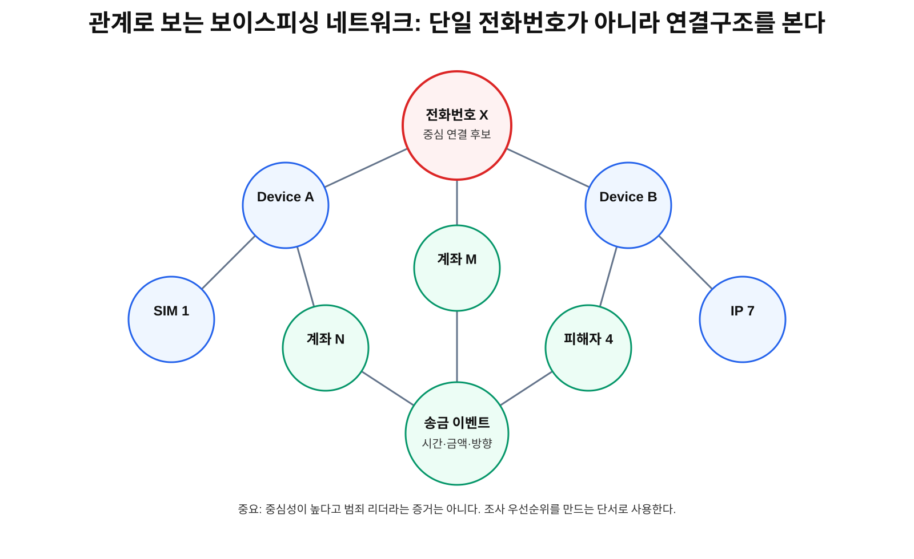
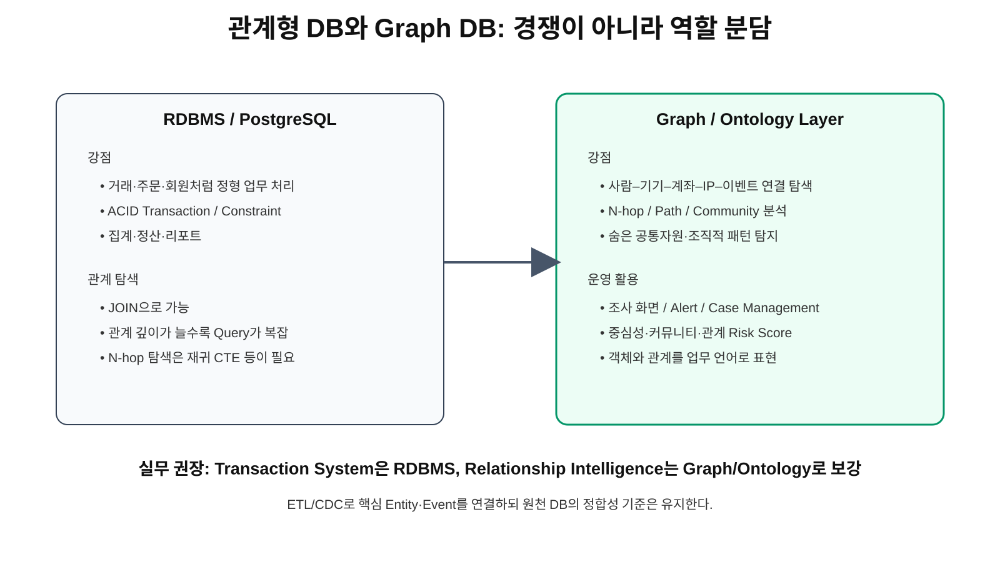
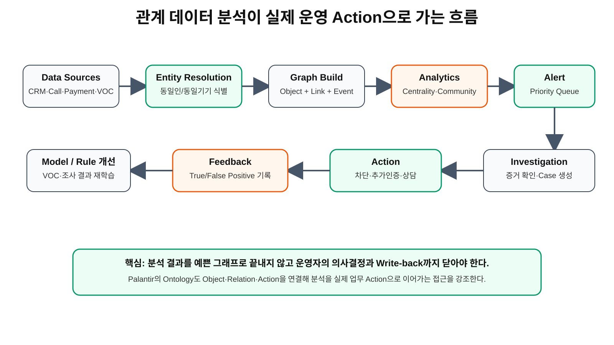
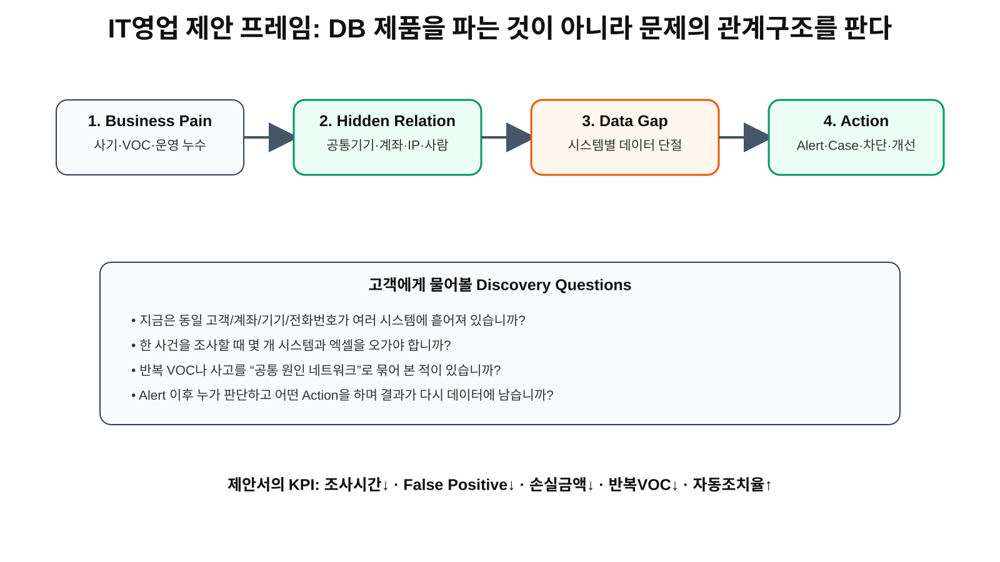

# 2026-09-26 TIL — Python 함수·조건 분기와 SQL LEFT JOIN·집계

## 오늘의 핵심

오늘은 데이터를 단순히 읽고 출력하는 단계를 넘어, 업무 규칙을 재사용 가능한 함수로 분리하는 방법과 관계형 데이터에서 기준 데이터를 누락하지 않고 집계하는 방법을 학습했다.

핵심 주제는 다음 두 가지다.

- Python: 함수의 입력·처리·반환 구조와 다중 조건 분기
- PostgreSQL: LEFT JOIN을 이용한 기준 데이터 보존과 COUNT 집계
- 실무 관점: 잘못된 조건 순서나 JOIN 조건 위치가 운영지표와 VOC에 미치는 영향

오늘도 공부하기 모드를 유지하여 완성 코드와 정답 SQL을 기록하지 않고, 문제를 푸는 구조와 판단 기준을 중심으로 정리했다.

---

## 1. 오늘의 학습 맥락

기능을 구현할 때 중요한 것은 문법을 외우는 것이 아니라 데이터가 들어와서 어떤 업무 규칙을 거쳐 어떤 결과로 나가는지 설명할 수 있는 것이다.

오늘의 전체 흐름은 다음과 같다.

~~~text
원본 데이터 확인
→ 처리 대상 한 건의 구조 파악
→ 업무 조건의 우선순위 결정
→ 함수 또는 SQL로 처리 책임 분리
→ 결과 형태 예상
→ 누락·중복·오분류 검증
→ 운영지표와 VOC 영향 확인
~~~

Python과 SQL은 문법은 다르지만 공통적으로 다음 질문을 먼저 요구한다.

1. 기준 데이터는 무엇인가?
2. 여러 개인 데이터는 무엇인가?
3. 한 건씩 무엇을 확인하는가?
4. 어떤 조건을 판단하는가?
5. 무엇을 계산하거나 누적하는가?
6. 최종 결과는 어떤 형태여야 하는가?

---

# Part 1. Python 함수와 다중 조건 분기

## 2. 함수가 필요한 이유

함수는 단순히 코드를 짧게 만드는 문법이 아니다.

함수는 하나의 업무 규칙을 이름이 있는 처리 단위로 묶는 도구다. 같은 판정 기준을 화면, 배치, 관리자 기능, API 등 여러 곳에서 사용한다면 규칙을 함수로 모아 두는 것이 좋다.

예를 들어 재고 상태를 판단하는 규칙이 여러 화면에 흩어져 있으면 다음 문제가 생길 수 있다.

- 사용자 화면에서는 품절인데 관리자 화면에서는 발주 필요로 표시될 수 있다.
- 안전재고 기준이 바뀌었을 때 여러 파일을 각각 수정해야 한다.
- 일부 코드만 수정되어 화면별 결과가 달라질 수 있다.
- 같은 조건을 반복 작성하면서 경계값 처리 방식이 달라질 수 있다.

따라서 재고 상태 판정처럼 의미가 분명한 규칙은 하나의 함수로 분리하는 것이 좋다.

~~~text
상품 한 건 입력
→ 재고와 안전재고 확인
→ 업무 조건 판정
→ 상태값 반환
~~~

## 3. 함수의 입력·처리·반환

함수를 이해할 때는 다음 세 부분으로 나누어 생각한다.

| 구분 | 의미 | 오늘의 예시 |
|---|---|---|
| 입력 | 함수가 판단하기 위해 받는 데이터 | 상품 한 건 |
| 처리 | 함수 내부에서 적용하는 업무 규칙 | 재고와 안전재고 비교 |
| 반환 | 함수 밖에서 다시 사용할 결과 | 품절·발주 필요·정상 상태 |

여기서 중요한 것은 출력과 반환을 구분하는 것이다.

출력은 화면에 값을 보여주는 행동이고, 반환은 함수가 계산한 결과를 호출한 곳에 넘겨주는 행동이다. 반환된 값은 목록에 저장하거나, 상태별 개수를 세거나, 화면에 표시하거나, DB에 저장하는 등 다음 처리에 다시 사용할 수 있다.

실무에서는 함수 내부에서 무조건 출력하기보다 결과를 반환하도록 설계하는 편이 재사용성과 테스트에 유리하다.

## 4. 조건의 순서가 중요한 이유

다중 조건에서는 같은 데이터를 보더라도 조건을 검사하는 순서에 따라 결과가 달라질 수 있다.

재고 판정 규칙을 예로 들면 다음과 같은 경계값이 존재한다.

- 재고가 0인 경우
- 재고가 0보다 크고 안전재고 이하인 경우
- 재고가 안전재고보다 많은 경우
- 재고와 안전재고가 같은 경우

조건이 서로 겹칠 수 있다면 더 구체적이고 예외적인 조건을 먼저 확인하는 것이 안전하다.

~~~text
특수 상태 확인
→ 경계 상태 확인
→ 나머지 정상 상태 처리
~~~

재고 0을 별도 조건으로 먼저 확인하지 않으면 품절 상품이 발주 필요 상품과 섞일 수 있다. 업무적으로는 둘 다 재고 대응이 필요하지만, 고객에게 판매할 수 있는지와 운영자가 추가 발주해야 하는지는 서로 다른 의미다.

## 5. 오늘의 Python 6단계 구조화

### 1) 어떤 데이터가 주어졌는가?

상품 여러 건이 들어 있는 리스트가 있고, 상품 한 건은 상품명·현재 재고·안전재고를 가진 딕셔너리다.

### 2) 여러 개인 것은 무엇인가?

상품이 여러 개다. 따라서 상품 목록 전체가 반복 대상이 된다.

### 3) 무엇을 하나씩 반복해야 하는가?

상품을 한 건씩 꺼내 상태 판정 함수에 전달해야 한다.

### 4) 무엇을 판단해야 하는가?

현재 재고가 품절 기준, 발주 필요 기준, 정상 기준 중 어디에 해당하는지 판단해야 한다.

### 5) 계산하거나 바꿔야 하는 값은 무엇인가?

- 상품별 판정 결과
- 발주 필요 상품명 목록
- 상태별 상품 개수

이 값들은 반복 과정에서 계속 기억하거나 증가시켜야 한다.

### 6) 최종 출력은 무엇인가?

- 상품명과 판정 상태
- 발주 필요 상품 목록
- 상태별 상품 수

## 6. 함수와 반복문의 책임 분리

함수와 반복문이 모든 일을 한꺼번에 담당하게 만들면 코드 흐름을 이해하기 어려워진다.

오늘 문제에서는 책임을 다음과 같이 나누어 생각할 수 있다.

| 처리 단위 | 책임 |
|---|---|
| 상태 판정 함수 | 상품 한 건의 상태를 판단하고 반환 |
| 반복문 | 상품을 한 건씩 함수에 전달 |
| 결과 저장 구조 | 상품별 결과와 상태별 개수를 기억 |
| 최종 출력 | 저장된 결과를 사용자에게 보여줌 |

이렇게 책임을 나누면 문제가 생겼을 때 원인을 찾기 쉽다.

- 상태가 잘못되면 판정 함수 확인
- 일부 상품이 빠지면 반복 범위 확인
- 개수가 틀리면 누적 로직 확인
- 화면이 이상하면 출력 단계 확인

## 7. Python에서 주의할 경계값

업무 규칙에는 항상 경계값이 존재한다.

오늘 문제에서는 재고와 안전재고가 같은 경우가 대표적인 경계값이다. 요구사항에서 이하인지 미만인지에 따라 결과가 달라진다.

실무에서는 다음을 명확히 문서화해야 한다.

- 0을 포함하는가?
- 같은 값을 포함하는가?
- 음수 재고가 들어올 수 있는가?
- 값이 비어 있거나 문자열이면 어떻게 처리하는가?
- 안전재고 기준이 상품마다 다른가?
- 품절과 판매중지 상태를 같은 의미로 보는가?

단순한 비교 연산 하나에도 업무정책이 들어 있다.

---

# Part 2. SQL LEFT JOIN과 집계

## 8. 관계형 데이터의 기준 테이블

관계형 데이터베이스에서는 한 업무 대상을 여러 테이블로 나누어 저장한다.

오늘의 예시는 강의와 수강신청이다.

- courses: 강의 자체를 관리하는 기준 엔터티
- enrollments: 학생이 강의를 신청한 사건을 기록하는 업무 엔터티

한 강의에는 여러 수강신청이 연결될 수 있다.

~~~text
강의 1개
→ 수강신청 0개 이상
~~~

여기서 중요한 점은 수강신청이 없는 강의도 실제로 존재하는 강의라는 것이다. 수강신청이 없다고 해서 강의 데이터 자체가 사라져서는 안 된다.

## 9. INNER JOIN과 LEFT JOIN의 차이

INNER JOIN은 두 테이블에서 연결되는 행이 모두 존재할 때만 결과에 포함한다.

LEFT JOIN은 왼쪽 기준 테이블의 행을 모두 남기고, 오른쪽 테이블에 연결되는 데이터가 없으면 오른쪽 값을 NULL로 표현한다.

| 목적 | 적합한 방식 |
|---|---|
| 실제로 연결된 데이터만 확인 | INNER JOIN |
| 기준 데이터 전체를 유지 | LEFT JOIN |
| 신청이 있는 강의만 조회 | INNER JOIN 가능 |
| 신청이 없는 강의까지 조회 | LEFT JOIN 필요 |

JOIN의 종류는 단순 문법 선택이 아니다. 최종 보고서에서 무엇을 누락시키지 않을 것인지 결정하는 업무 판단이다.

## 10. COUNT에서 무엇을 세는가

LEFT JOIN 이후 행의 개수를 계산할 때 COUNT의 대상을 주의해야 한다.

기준 테이블의 행은 연결 데이터가 없어도 결과에 남아 있다. 따라서 무조건 결과 행 전체를 세면 실제 수강신청이 없는 강의도 1건으로 잘못 계산될 수 있다.

집계하려는 사건 테이블의 식별자를 기준으로 세어야 연결 데이터가 없는 경우 0으로 계산되는 구조를 만들 수 있다.

~~~text
강의 행은 유지
→ 연결된 수강신청 식별자 확인
→ 실제 연결된 신청만 집계
~~~

핵심은 무엇을 세고 있는지 설명할 수 있어야 한다는 점이다.

## 11. ON 조건과 WHERE 조건의 차이

LEFT JOIN에서는 조건의 위치가 결과 보존 여부에 영향을 준다.

- ON: 어떤 행을 연결할지 결정한다.
- WHERE: JOIN 결과가 만들어진 뒤 어떤 행을 남길지 결정한다.

취소되지 않은 수강신청만 연결하고 싶을 때 상태 조건을 잘못 배치하면, 오른쪽 테이블 값이 NULL인 행이 WHERE 단계에서 제거될 수 있다. 그러면 수강신청이 없는 강의를 남기기 위해 사용한 LEFT JOIN의 목적이 사라진다.

따라서 조건을 작성하기 전에 다음을 구분해야 한다.

1. 연결할 데이터의 조건인가?
2. 최종 결과에서 행 자체를 제거할 조건인가?

이 구분은 SQL 결과 누락을 방지하는 핵심이다.

## 12. GROUP BY가 필요한 이유

강의 하나에 수강신청이 여러 건 연결되면 JOIN 결과에는 같은 강의가 여러 행으로 나타난다.

강의별 수강인원을 계산하려면 같은 강의를 하나의 그룹으로 묶고, 그룹 안의 수강신청을 세어야 한다.

~~~text
courses
→ enrollments 연결
→ 강의별 그룹화
→ 신청 식별자 집계
→ 정렬
~~~

최종적으로 강의 제목과 수강인원처럼 집계되지 않은 기준 열을 함께 조회한다면, 어떤 열을 그룹 기준에 포함해야 하는지 확인해야 한다.

## 13. 오늘의 SQL 구조화

### 기준 테이블

모든 강의를 결과에 남겨야 하므로 강의 테이블이 기준이다.

### 연결 테이블

수강상태와 수강신청 식별자를 가진 수강신청 테이블을 연결한다.

### 관계 열

두 테이블에서 같은 강의를 가리키는 강의 식별자를 기준으로 연결한다.

### 조건

현재 수강 중인 신청만 인원에 포함한다. 취소된 신청과 연결 데이터가 없는 경우를 구분해야 한다.

### 집계

강의별로 실제 연결된 수강신청 식별자의 개수를 계산한다.

### 출력

강의 식별자, 강의명, 현재 수강인원처럼 업무에서 필요한 결과 열을 정의한다.

### 정렬

먼저 수강인원 기준으로 정렬하고, 인원이 같을 때 사용할 두 번째 기준도 명확히 정한다.

---

# Part 3. Python과 SQL의 공통 사고법

## 14. 서로 다른 문법, 같은 처리 구조

Python과 SQL은 다음과 같은 공통 흐름을 가진다.

| 사고 단계 | Python | SQL |
|---|---|---|
| 기준 데이터 | 상품 리스트 | courses 테이블 |
| 반복·확장 | 상품을 한 건씩 확인 | JOIN으로 관련 행 확장 |
| 조건 | if·elif·else | ON·WHERE |
| 그룹화 | 딕셔너리 등에 누적 | GROUP BY |
| 계산 | 상태별 개수 증가 | COUNT |
| 출력 | 리스트·딕셔너리·화면 | SELECT 결과 |

Python은 처리 절차를 순서대로 작성하고, SQL은 원하는 결과 집합을 선언한다는 차이가 있다. 하지만 데이터·조건·계산·출력의 구조를 먼저 나누는 사고법은 동일하다.

## 15. End-to-End 관점

실제 웹서비스에서는 오늘 학습한 두 개념이 다음처럼 연결될 수 있다.

~~~text
사용자 요청
→ Django 또는 Flask Route
→ PostgreSQL에서 강의·수강현황 조회
→ Python 함수로 상태 또는 표시문구 판정
→ Template에 결과 전달
→ 사용자 화면 렌더링
~~~

예를 들어 SQL에서 수강신청이 없는 강의를 누락하면 Python과 화면에서는 그 강의가 존재하는지조차 알 수 없다. 반대로 SQL 결과가 올바르더라도 Python 함수의 조건이 틀리면 사용자 화면의 상태가 잘못 표시될 수 있다.

따라서 화면 오류를 진단할 때는 어느 단계에서 데이터가 달라졌는지 추적해야 한다.

---

# Part 4. VOC와 운영 관점

## 16. 예상 가능한 고객 증상

오늘의 개념이 잘못 구현되면 다음 VOC가 발생할 수 있다.

### 재고 관련 VOC

- 재고가 있는데 품절로 보여요.
- 품절인데 주문이 가능해요.
- 상품마다 발주 기준이 다르게 보여요.
- 관리자 화면과 고객 화면의 상태가 달라요.

### 수강현황 관련 VOC

- 개설된 강의가 목록에서 사라졌어요.
- 수강생이 없는데 1명으로 표시돼요.
- 취소한 학생이 수강인원에 포함돼요.
- 강의별 수강인원 합계가 실제 신청내역과 달라요.

이러한 증상은 화면 문제처럼 보이지만 실제 원인은 Python 조건, JOIN 방식, COUNT 대상, 상태 조건 위치 등에 있을 수 있다.

## 17. VOC에서 Root Cause로 연결하기

| 고객 증상 | 가능한 Root Cause | 개발 확인사항 |
|---|---|---|
| 품절 상품이 발주 필요로 표시 | 조건 우선순위 오류 | 경계값·조건 순서 테스트 |
| 같은 상품 상태가 화면마다 다름 | 업무 규칙 중복 구현 | 공통 함수·서비스 계층 확인 |
| 신청 없는 강의가 사라짐 | INNER JOIN 사용 또는 WHERE 조건 오류 | 기준 테이블·JOIN 방식 확인 |
| 수강인원이 1명으로 표시 | COUNT 대상 오류 | 사건 테이블 식별자 집계 확인 |
| 취소 신청이 포함됨 | 상태 필터 누락 | 유효 상태 정의·필터 위치 확인 |

고객의 문장을 그대로 개발 작업으로 옮기기보다 증상, 데이터, 조건, 계산, 결과를 나누어 Root Cause를 확인해야 한다.

## 18. 개발 요구사항으로 번역하기

VOC를 줄이기 위해 다음과 같은 개발 요구사항을 만들 수 있다.

- 재고 판정 규칙을 공통 함수 또는 서비스 계층으로 통합한다.
- 0, 경계값, 음수, NULL에 대한 단위 테스트를 작성한다.
- 관리자 화면에 현재 재고와 안전재고를 함께 표시한다.
- 기준 데이터가 누락되지 않도록 LEFT JOIN 요구사항을 명시한다.
- 집계 기준에 취소·삭제·비활성 상태 포함 여부를 문서화한다.
- 상세 데이터와 집계 데이터가 일치하는지 검증 쿼리를 마련한다.
- 화면 숫자에 집계 기준 시각과 대상 상태를 표시한다.
- 배포 후 이전 기간 대비 누락률과 오류 VOC를 비교한다.

## 19. 신생회사가 놓치기 쉬운 누수

- 업무 규칙을 여러 화면에 복사하여 결과가 달라진다.
- 이하와 미만 같은 경계조건이 문서화되지 않는다.
- NULL과 0을 같은 의미로 처리한다.
- 기준 데이터가 결과에서 사라져도 오류로 감지하지 않는다.
- COUNT가 무엇을 세는지 확인하지 않는다.
- 취소·삭제·비활성 상태의 포함 기준이 팀마다 다르다.
- 화면 집계값과 원본 상세내역을 대사하지 않는다.
- 고객 문의가 들어와야 데이터 누락을 발견한다.
- 운영자가 숫자를 수동 보정하지만 이력을 남기지 않는다.
- 테스트 데이터에는 정상 사례만 있고 0건·경계값 사례가 없다.

## 20. 모니터링과 재발 방지

운영환경에서는 다음 항목을 선제적으로 확인할 수 있다.

- 품절·발주 필요·정상 상품 수의 갑작스러운 변화
- 음수 재고와 NULL 재고 건수
- 화면 상태와 원본 재고값의 불일치
- 개설 강의 수와 집계 결과 행 수의 차이
- 취소 상태가 집계에 포함된 건수
- 상세 신청 건수와 그룹별 합계의 차이
- 배포 전후 관련 VOC 증가율
- 수동 보정 횟수와 보정 사유

재발 방지의 핵심은 오류를 수정하는 데서 끝나지 않고 같은 유형의 잘못된 데이터가 다시 만들어지거나 다시 표시될 때 자동으로 감지하는 것이다.

~~~text
VOC
→ 증상 분류
→ 원본 데이터 확인
→ 조건·JOIN·집계 검증
→ 코드 수정
→ 경계값 테스트
→ 배포
→ 지표·VOC 변화 확인
→ 재발 방지
~~~

---

## 21. 오늘의 실무 체크리스트

### Python

- [ ] 함수의 입력이 명확한가?
- [ ] 함수가 한 가지 책임에 집중하는가?
- [ ] 출력과 반환을 구분했는가?
- [ ] 조건의 우선순위가 업무 규칙과 일치하는가?
- [ ] 0, 동일값, 음수, NULL을 확인했는가?
- [ ] 반복 중 기억할 값을 별도 자료구조로 준비했는가?
- [ ] 상태별 개수와 상세 목록이 서로 일치하는가?

### SQL

- [ ] 반드시 남겨야 하는 기준 테이블을 정했는가?
- [ ] 관계 열이 올바른가?
- [ ] INNER JOIN과 LEFT JOIN 중 목적에 맞게 선택했는가?
- [ ] ON 조건과 WHERE 조건의 역할을 구분했는가?
- [ ] COUNT 대상 열이 올바른가?
- [ ] GROUP BY 기준이 최종 출력과 맞는가?
- [ ] 0건 데이터도 예상대로 표시되는가?
- [ ] 집계 결과와 상세내역을 대사했는가?

### 운영·VOC

- [ ] 고객 증상과 Root Cause를 구분했는가?
- [ ] 오류가 영향을 준 사용자와 데이터 범위를 확인했는가?
- [ ] 운영자가 수동 처리한 내역이 기록되는가?
- [ ] 배포 후 오류율과 VOC가 실제로 감소했는가?
- [ ] 같은 문제가 재발하면 자동으로 감지할 수 있는가?

---

## 22. 오늘의 배운 점

첫째, 함수는 문법을 묶는 도구가 아니라 업무 규칙을 한곳에서 관리하기 위한 단위다.

둘째, 조건문은 위에서부터 판단되므로 조건의 순서와 경계값 정의가 결과의 정확성을 결정한다.

셋째, LEFT JOIN은 단순히 데이터를 연결하는 문법이 아니라 기준 데이터를 누락하지 않겠다는 업무 요구사항을 표현한다.

넷째, COUNT는 행을 세는 함수처럼 보이지만 어떤 열을 세는지에 따라 0건 데이터가 잘못 계산될 수 있다.

다섯째, ON과 WHERE의 조건 위치는 결과 행의 보존 여부를 바꾸므로 문법보다 업무 목적을 먼저 확인해야 한다.

여섯째, 화면에서 보이는 숫자는 Python 함수, SQL JOIN, 상태 조건, 집계 기준을 모두 통과한 결과이므로 전체 흐름을 연결해서 검증해야 한다.

---

## 23. 다음에 연습할 포인트

- Python 함수에 잘못된 입력값이 들어왔을 때 처리하는 방법
- 반환값을 리스트나 딕셔너리에 저장하는 방법
- 함수 단위 테스트와 경계값 테스트
- SQL에서 NULL을 다른 표시값으로 바꾸는 방법
- INNER JOIN·LEFT JOIN 결과 비교
- 상세행과 집계 결과의 대사
- 세 개 이상의 테이블을 연결할 때 중복행이 생기는 이유
- 운영지표와 VOC를 이용한 배포 효과 검증

---

## 보안 기록 원칙

공개 저장소에는 실제 서버 IP, Host, 계정 ID, 비밀번호, DB 접속문자열, API Key, OAuth Secret, Gmail 앱 비밀번호, PG Secret, Slack Webhook URL, 환경변수 실제 값을 기록하지 않는다.

민감한 값을 예시로 남겨야 하는 경우에는 반드시 다음처럼 마스킹한다.

~~~text
SERVER_IP=***
DB_PASSWORD=***
API_KEY=***
OAUTH_SECRET=***
WEBHOOK_URL=***
~~~

실제 값은 .env, 운영 환경변수 또는 별도의 Secret 관리도구에서 관리하고 Git에 커밋하지 않는다.

---

# Part 5. 관계(Relationship) 데이터를 실무 문제 해결에 쓰는 법

## 24. 왜 행과 열만 보면 부족한가

관계형 데이터베이스는 주문, 회원, 결제, 수강신청처럼 정형 업무를 안정적으로 처리하는 데 강하다. 하지만 실제 사고와 VOC는 한 테이블 안에서만 발생하지 않는다.

~~~text
사람
↔ 전화번호
↔ 기기
↔ IP
↔ 계좌
↔ 송금
↔ 피해자
↔ 상담기록
~~~

따라서 실무에서 중요한 질문은 '이 전화번호의 속성은 무엇인가?'보다 '이 전화번호가 어떤 사람·기기·계좌·이벤트와 연결되어 있고, 그 연결 구조가 정상 사용자와 어떻게 다른가?'에 가깝다.

Palantir Foundry의 Ontology도 현실 세계의 개체를 Object, 연결을 Relation/Link, 업무 변화를 Action으로 표현해 분석을 운영 의사결정과 실제 Action으로 연결한다.

참고: https://www.palantir.com/explore/platforms/foundry/ontology/

---

## 25. 예시: 보이스피싱 네트워크를 관계로 조사하기

다음은 관계 분석 구조를 설명하기 위한 가상 사례다.

처음 신고는 서로 관련 없어 보인다.

~~~text
피해자 A → 전화번호 A → 300만원 송금
피해자 B → 전화번호 B → 120만원 송금
피해자 C → 전화번호 C → 700만원 송금
~~~

전화번호만 보면 서로 다른 사건이다. 그러나 관계를 이어 보면 다음과 같은 공통점이 나올 수 있다.

~~~text
전화번호 A → Device X → 계좌 111
전화번호 B → Device X → 계좌 222
전화번호 C → Device Y → 계좌 111
Device X → IP 7
Device Y → IP 7
~~~

이렇게 여러 피해 사건이 공통 기기·계좌·IP로 수렴하면 개별 사건이 아니라 하나의 네트워크로 조사할 수 있다. 연결수가 많거나 여러 하위 집단을 이어주는 전화번호·계좌·Device·IP는 조사 우선순위가 높은 중심 노드 후보가 된다.

다만 중심성이 높다고 범죄 리더라고 단정하면 안 된다. 그래프 분석은 범죄자 판정기가 아니라 숨은 연결을 찾아 조사 우선순위를 만드는 도구다.

FBI도 Money Mule이 피해자와 범죄자 사이에 여러 층을 추가해 자금추적을 어렵게 한다고 설명한다. 여러 계좌와 중간 전달자를 따라가는 관계 분석이 중요한 이유다.

참고:
- https://www.fbi.gov/how-we-can-help-you/common-frauds-and-scams/money-mules
- https://www.fbi.gov/news/podcasts/inside-the-fbi-podcast-tech-support-scams
- https://archives.fbi.gov/archives/news/stories/2010/october/cyber-banking-fraud/cyber-banking-fraud-graphic

---

## 26. RDBMS와 Graph DB는 경쟁이 아니라 역할 분담

PostgreSQL이 잘하는 것:
- 주문·회원·결제·정산
- ACID Transaction
- 제약조건
- 정형 집계
- Source of Truth 역할

Graph/Ontology가 잘하는 것:
- 사람→전화번호→계좌→Device→IP 같은 N-hop 탐색
- 숨은 공통자원 탐지
- Fraud Ring / Collusion 탐지
- Community / Path / Centrality 분석
- 조사 화면에서 관계 시각화

실무 구조는 보통 다음처럼 가져갈 수 있다.

~~~text
Operational DB: PostgreSQL
→ 거래와 상태의 Source of Truth

ETL / CDC / Batch
↓

Relationship Layer: Graph / Ontology
→ Object + Link + Event

Analytics
→ Risk Score / Centrality / Community

Operations
→ Alert / Case / Investigation / Action
~~~

Neo4j도 Fraud Detection 사례에서 단순 거래금액보다 공유 자산과 숨은 관계를 찾아 계정탈취·보험사기·사기 조직을 조사하는 활용을 제시한다.

참고: https://neo4j.com/use-cases/fraud-detection/

---

## 27. Node보다 중요한 것은 Edge 설계

Node 예시:
- Person
- Phone
- Account
- BankAccount
- Device
- IP
- Address
- Merchant
- VOC
- Transaction
- LoginEvent

Edge 예시:
- Person USES_PHONE Phone
- Person OWNS_ACCOUNT Account
- Account LOGGED_IN_FROM Device
- Device USES_IP IP
- Phone CALLED Person
- Transaction FROM BankAccount
- Transaction TO BankAccount
- VOC ABOUT Transaction

Edge에도 속성이 필요하다.

예를 들어 CALLED 관계에는 called_at, duration, count가 필요하고, TRANSFERRED_TO 관계에는 amount, transferred_at, channel 같은 값이 필요하다.

누가 연결되어 있는가뿐 아니라 언제, 몇 번, 얼마만큼 연결되었는지가 위험도를 바꾼다.

---

## 28. Entity Resolution이 그래프보다 먼저다

관계 분석에서 가장 어려운 전처리 중 하나는 '이 두 데이터가 같은 사람인가?'를 판단하는 일이다.

시스템마다 전화번호 포맷, 이름, 주소, 이메일 표현이 다르면 같은 사람을 다른 사람으로 분리할 수 있다. 반대로 다른 사람을 하나로 합치면 정상 고객을 위험 네트워크에 잘못 묶는 False Positive가 발생한다.

따라서 다음이 필요하다.
- 전화번호·이메일 정규화
- 주소 표준화
- 식별정보 해시 매칭
- Device Fingerprint
- Rule 기반 매칭
- Fuzzy Matching
- Probabilistic Entity Resolution

Entity Resolution 정확도가 관계 분석의 바닥 품질을 결정한다.

---

## 29. Data Scientist가 보는 주요 Graph Feature

### Degree Centrality
직접 연결 수를 본다. 피해자 42명과 연결된 전화번호, 여러 계정에서 공유되는 Device 같은 허브를 찾을 수 있다.

### Betweenness Centrality
서로 다른 집단 사이의 경로를 많이 연결하는 브리지 노드를 찾는다. 중간책·허브계좌·공통 관리자 계정 후보 탐지에 유용하다.

### PageRank / Eigenvector 계열
중요한 노드와 연결된 노드에 더 높은 가중치를 줄 수 있다. 단순 연결 수보다 이미 위험도가 높은 계좌나 Device와 반복 연결되는지를 볼 때 유용하다.

### Connected Components
전체 사건을 실제 연결된 독립 네트워크로 분리한다. 100건의 신고가 사실 7개 조직으로 묶일 수 있다.

### Community Detection
큰 네트워크 안에서 밀접하게 연결된 하위 그룹을 찾는다. 지역별·역할별 하위 조직이나 계좌군을 분리할 수 있다.

### K-core / Dense Subgraph
서로 촘촘하게 반복 연결되는 핵심 집단을 찾는다. 일회성 피해자보다 내부 운영계정·기기군을 구분하는 데 힌트가 된다.

---

## 30. 시간축을 넣어야 진짜 실무 데이터가 된다

같은 관계라도 시간 순서가 다르면 의미가 달라진다.

~~~text
신규 계정 생성
↓ 4분
고액 입금
↓ 30초
다수 계좌 분산송금
↓ 2분
전액 출금
~~~

따라서 event_time, sequence, time_gap, frequency, amount_velocity 같은 Temporal Feature가 중요하다.

관계 + 시간 + 금액을 함께 봐야 Fraud Network의 행동 패턴이 보인다.

---

## 31. 사례 비교

### Case A. 보이스피싱 / Tech Support Scam
피해자→전화번호→Device→IP→중간계좌→Money Mule→최종계좌의 흐름을 본다. 여러 피해자가 공통으로 접촉한 번호, 여러 사건 자금을 받는 Funnel Account, 여러 Mule을 이어주는 계좌를 조사한다.

### Case B. 보험사기
보험가입자↔병원↔정비업체↔손해사정인↔사고↔계좌를 연결한다. 단독 청구는 정상처럼 보여도 동일 병원·업체·전문가 조합이 반복되면 Collusion 가능성을 조사할 수 있다.

### Case C. 계정탈취
서로 무관해 보이는 Account A/B/C가 동일 Device X와 IP Y를 공유하면 공통 공격자 가능성을 조사한다. 신규 Device, 비밀번호 변경, MFA 실패, 고액 결제 같은 이벤트를 함께 본다.

### Case D. 기업 VOC 네트워크
VOC→상품→배포 Version→API→Server→담당팀을 연결한다. 예를 들어 환불 VOC가 Version 2.4.1 이후 payment-confirm API와 특정 PG Timeout에 집중된다면 고객 문제에서 기술 Root Cause까지 관계로 연결할 수 있다.

---

## 32. 분석을 실제 운영 Action으로 닫기

~~~text
Data Sources
↓
Entity Resolution
↓
Graph Build
↓
Feature / Rule / Model
↓
Alert
↓
Investigator Review
↓
Action
↓
Result Write-back
↓
Model / Rule 개선
~~~

Palantir의 Alerting Workflow도 우선순위 Alert를 사용자에게 제공하고, 사용자의 판단을 다시 데이터에 기록해 운영 시스템으로 이어가는 패턴을 설명한다.

참고: https://www.palantir.com/docs/foundry/use-case-patterns/alerting-workflow

---

## 33. Alert에는 '왜 위험한지'가 보여야 한다

나쁜 Alert는 Risk Score 92만 보여준다.

좋은 Alert는 근거를 함께 보여준다.

~~~text
Risk Score: 92
- 피해 신고 번호 8개와 연결
- 24시간 내 신규계좌 5개에서 입금
- 동일 Device에서 12개 계정 로그인
- 3-hop 이내 기존 Fraud 계좌 4개 존재
- 30분 내 자금 98% 재송금
~~~

Data Science는 Score를 만드는 것뿐 아니라 운영자가 Score의 근거를 이해하고 판단하도록 만드는 Explainability까지 포함해야 한다.

---

## 34. False Positive를 줄이는 방법

공용 IP, 콜센터 대표번호, 회사 Wi-Fi, 대형 병원처럼 정상적으로 연결이 많은 허브가 존재한다.

따라서 한 Feature만으로 위험을 결정하면 안 된다.

~~~text
공용 IP 단독
= 약한 신호

공용 IP
+ 신규 Device
+ 다수 계정
+ 고액결제
+ 짧은 시간
= 강한 신호
~~~

운영자는 True Positive / False Positive / Need More Evidence를 기록해야 한다. 이 Feedback이 다음 Rule과 Model 개선 데이터가 된다.

---

## 35. VOC와 Relationship Intelligence를 결합하는 이유

신생회사는 같은 Root Cause에서 나온 VOC를 서로 다른 카테고리로 나누어 집계하는 경우가 많다.

관계로 보면:

~~~text
VOC A
VOC B
VOC C
↓
같은 Journey
↓
같은 API
↓
같은 Release
↓
같은 Server
~~~

처럼 표면상 다른 문의를 하나의 원인 네트워크로 묶을 수 있다.

특히 다음 누수가 생긴다.
- 전화상담·로그·결제·배포 데이터가 분리됨
- 같은 고객이 시스템마다 다른 ID로 관리됨
- 반복 VOC가 같은 Device/계좌/전화번호와 연결되는지 모름
- 장애 종료 후 실제 고객 영향 범위를 연결하지 못함
- 조사 결과가 Excel에만 남고 시스템에 Write-back되지 않음

---

## 36. IT영업에서 설명하는 법

고객에게 'Graph DB를 도입하세요'부터 말하면 안 된다. Business Pain부터 확인해야 한다.

Discovery Questions:
1. 사건 하나 조사할 때 몇 개 시스템과 엑셀을 오갑니까?
2. 동일 고객·계좌·전화번호·Device가 여러 시스템에서 다른 ID로 관리됩니까?
3. 건별 조사 후 같은 조직에서 나온 다른 사건까지 자동으로 연결됩니까?
4. 반복 VOC가 같은 배포·API·서버와 연결되는지 자동으로 알 수 있습니까?
5. Alert 후 담당자의 판단이 다시 데이터로 남습니까?

제안의 KPI는 DB 구축 자체가 아니라 다음이어야 한다.
- 평균 조사시간 감소
- 사건당 확인 시스템 수 감소
- Fraud Loss 감소
- False Positive 감소
- 반복 VOC 감소
- Case Closure Time 감소
- 탐지 후 Action까지 시간 감소

---

## 37. 고객사 PoC 설계 예시

처음부터 전사 데이터를 통합하려 하지 말고 최근 3개월 의심건처럼 범위를 좁힌다.

입력 데이터 예:
- 전화번호
- 고객
- 계좌
- 송금
- Device
- IP
- VOC

PoC 목표:
1. 기존 건별 조사로 놓친 공통 Network 찾기
2. 위험 Node Top N 도출
3. 기존 확정 Fraud와 연결 정도 검증
4. 조사시간 비교
5. False Positive 확인

영업 제안에서 중요한 것은 '그래프가 예쁘다'가 아니라 '조사시간이 몇 % 줄었고 손실금액을 얼마 줄일 수 있는가'다.

---

## 38. 데이터베이스 사이언티스트 관점의 전체 Pipeline

~~~text
Business Question
↓
Data Collection
↓
Data Quality
↓
Entity Resolution
↓
Graph Modeling
↓
Feature Engineering
↓
Rule + Model
↓
Explainability
↓
Human Review
↓
Action
↓
Feedback
↓
Monitoring
~~~

Feature 예:
- Degree
- Betweenness
- Shared Asset Count
- Transaction Velocity
- Temporal Motif
- Community ID
- Fraud Neighbor Ratio

---

## 39. Accuracy 하나로 모델을 평가하면 안 된다

Fraud가 0.1%라면 모든 거래를 정상이라고 예측해도 Accuracy는 99.9%가 될 수 있다. 하지만 Fraud는 하나도 잡지 못한다.

따라서 Precision, Recall, F1, PR-AUC, False Positive Rate, Fraud Amount Recall, Loss Prevented, Investigation Cost를 함께 본다.

운영 측면에서는 Alert 1,000건 중 실제 Fraud가 20건이라면 조사자가 감당하지 못할 수 있다. 모델 성능과 운영 처리용량을 함께 설계해야 한다.

---

## 40. 개인정보와 Governance

관계 데이터는 여러 시스템을 합치면서 원래 보이지 않던 개인 행동 패턴을 드러낼 수 있기 때문에 더 강한 통제가 필요하다.

필요 항목:
- 최소수집
- 목적 제한
- PII Masking
- Column/Row Level Security
- Audit Log
- Retention Policy
- 암호화
- 조사 목적 외 사용 제한
- Model/Rule 변경 이력
- Human Review

관계 분석 결과만으로 자동 제재하기보다 고위험 결정은 사람 검토와 추가 증거를 포함하는 것이 안전하다.

---

## 41. 신생회사가 놓치기 쉬운 관계 데이터 누수

1. 고객 ID가 시스템마다 다르다.
2. 전화번호 포맷이 달라 같은 번호가 여러 엔터티가 된다.
3. Device ID가 앱 재설치마다 바뀐다.
4. NAT/공용 IP를 동일인으로 오인한다.
5. Timestamp timezone이 다르다.
6. 탈퇴 고객과 과거 거래 관계가 끊긴다.
7. Fraud 확정 결과가 모델팀에 돌아가지 않는다.
8. VOC와 Transaction ID가 연결되지 않는다.
9. Release Version과 VOC가 연결되지 않는다.
10. 관계의 유효 시점을 저장하지 않는다.
11. Alert는 있지만 Owner가 없다.
12. 조사 결과가 Excel에만 남는다.
13. False Positive를 기록하지 않는다.
14. Model Score는 있지만 이유가 없다.
15. Graph를 만들었지만 Action이 없다.

---

## 42. 바로 영업·운영에 사용할 문장

기술 담당자에게:
'기존 PostgreSQL을 없애자는 제안이 아니라, 거래 DB 위에 Relationship Intelligence Layer를 만들어 JOIN만으로 찾기 어려운 N-hop 관계와 공통 자원을 조사 가능하게 하자는 제안입니다.'

운영 담당자에게:
'지금은 사건 10건을 10번 조사하지만, 관계를 연결하면 사실 하나의 조직에서 파생된 사건인지 먼저 볼 수 있습니다.'

경영진에게:
'목표는 Graph DB 구축이 아니라 조사시간·손실금액·반복 VOC·False Positive를 줄이는 것입니다.'

데이터팀에게:
'모델 Score만 주는 것이 아니라 Entity Resolution, Graph Feature, 조사자 Feedback까지 Closed Loop로 만들어야 합니다.'

---

## 43. 오늘의 고찰

LEFT JOIN을 공부할 때 단순한 테이블 연결 문법으로만 보면 실무 확장이 어렵다. 본질은 서로 다른 엔터티 사이 관계를 데이터로 표현하는 것이다.

~~~text
1-hop 관계
→ SQL JOIN

여러 단계 관계
→ Recursive Query / Graph Traversal

관계 패턴
→ Graph Analytics

위험도 계산
→ Data Science

Alert
→ Operations

조사 결과
→ Feedback

Action
→ Business Outcome
~~~

Palantir식 사고의 핵심도 특정 제품 하나가 아니라 현실 세계의 사람·자산·사건·관계를 데이터 객체로 만들고, 분석을 운영 Action으로 연결하는 것으로 이해할 수 있다.

---

## 44. 다음에 더 파고들 주제

- PostgreSQL Recursive CTE로 2-hop / 3-hop 관계 찾기
- Neo4j Cypher 기본 문법
- Entity Resolution 실습
- Degree / Betweenness 직접 계산
- NetworkX Fraud Network 시각화
- Community Detection
- Temporal Graph
- Graph Embedding
- Graph Neural Network
- VOC + Incident + Release Graph
- Risk Alert 관리자 화면
- Relationship Intelligence PoC 제안서

---

## 참고 자료

1. Palantir Foundry Ontology — https://www.palantir.com/explore/platforms/foundry/ontology/
2. Palantir Object/Link/Ontology Concepts — https://www.palantir.com/docs/foundry/getting-started/introductory-concepts
3. Palantir Link Types — https://www.palantir.com/docs/foundry/object-link-types/link-types-overview
4. Palantir Alerting Workflow — https://www.palantir.com/docs/foundry/use-case-patterns/alerting-workflow
5. Palantir Financial Services Ontology Example — https://www.palantir.com/docs/foundry/use-case-examples/improving-retention-and-collection-performance-through-intelligent-repricing
6. FBI Money Mules — https://www.fbi.gov/how-we-can-help-you/common-frauds-and-scams/money-mules
7. FBI Tech Support Scam Networks — https://www.fbi.gov/news/podcasts/inside-the-fbi-podcast-tech-support-scams
8. FBI Cyber Theft Ring — https://archives.fbi.gov/archives/news/stories/2010/october/cyber-banking-fraud/cyber-banking-fraud-graphic
9. Neo4j Fraud Detection — https://neo4j.com/use-cases/fraud-detection/

---

## 오늘의 한 줄 정리

> 데이터의 가치는 행 하나의 속성보다 사람·기기·계좌·전화번호·사건이 어떻게 연결되어 있는지를 보고, 그 관계를 실제 조사와 운영 Action으로 바꿀 때 더 커진다.
